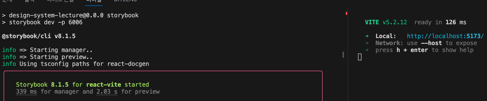
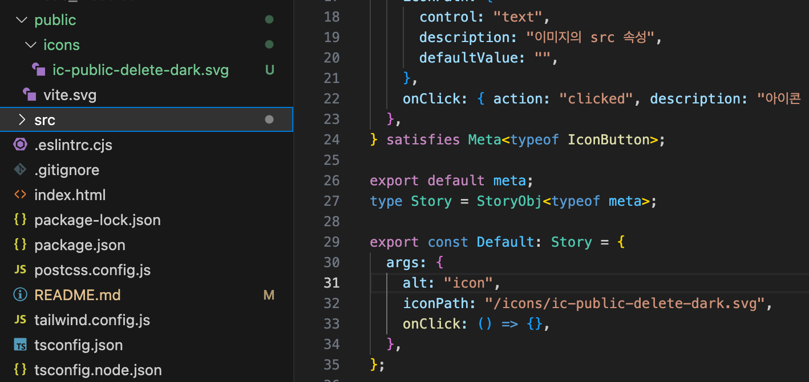
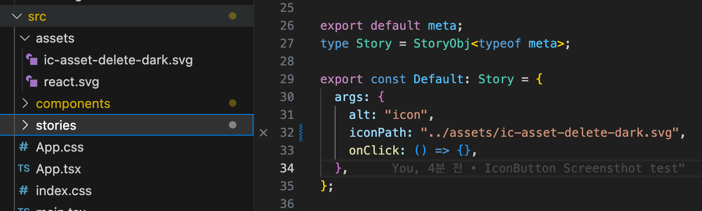
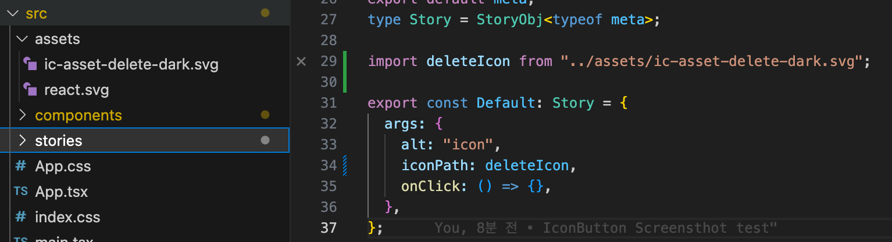

# 인프런 - 스토리북 강좌 따라하기

## 강의 노트 모음

https://www.inflearn.com/notes/62567

## 환경

- StoryBook 8v

## 시작

### 스토리북 서버 열기

`npm run storybook`

### 개발서버 열기

`npm run dev`



## svg파일 불러오기

svg 파일을 불러오는 방법으로는 총 3가지 방법으로

- public 폴더에 있는 svg 경로로 가져오기 ( ex. public/[...slug].svg )
- src/assets 폴더에 있는 svg 경로로 가져오기 ( ex. src/assets/[...slug].svg )
- 클라우드 서버에 올려둔 svg 경로로 가져오기 ( ex. https:ip/[...slug].svg )

### 1. public 폴더에 있는 svg 경로로 가져오기



### 2. assets 폴더에 있는 svg 경로로 가져오기

- public처럼 경로를 지정하면 될 줄 알았지만 경로를 찾을 수 없는 상황이 발생함
  

- 그래서 src폴더 아래에 있는 경우 react component와 같이 굳이 import로 가져와야함
  

### 3. 클라우드 서버에 올려둔 svg 경로로 가져오기

- 1번( public ) 때와 같이 경로로 가져오면 됩니다.

## 강의에선 설명이 빠져있지만 알아두면 좋을 것들

### <span style="color: orange;">.storybook/main.ts - autodocs</span>

autodocs는 Storybook 구성에서 문서화 자동 생성 기능과 관련된 설정입니다. Storybook에서 문서화는 주로 컴포넌트의 사용 방법, 속성, 상태 등을 설명하는 데 사용됩니다. autodocs 설정을 통해 Storybook은 컴포넌트에 대한 문서를 자동으로 생성하고 관리할 수 있습니다.

autodocs 설정의 값인 "tag"는 문서화 자동 생성 방식 중 하나를 지정합니다. 이 설정이 Storybook의 최신 버전에서 어떻게 작동하는지에 대해 더 자세히 설명하겠습니다.

autodocs: "tag"
목적: autodocs 설정은 Storybook에서 문서화 기능을 자동으로 활성화하고 구성하는 데 사용됩니다.
"tag" 값: 이 값은 컴포넌트의 JSDoc 또는 TypeScript 주석을 기반으로 자동으로 문서를 생성하도록 Storybook에 지시합니다. 즉, 컴포넌트 파일에 있는 주석이나 타입 정의를 기반으로 문서가 자동으로 생성됩니다.
예시
예를 들어, 다음과 같이 TypeScript로 작성된 컴포넌트가 있다고 가정해봅시다.

```tsx
/**

- 버튼 컴포넌트입니다.
-
- @param props - 버튼 컴포넌트의 속성
- @param props.label - 버튼에 표시될 텍스트
- @param props.onClick - 버튼 클릭 시 호출될 함수
*/
const Button = ({ label, onClick }: { label: string; onClick: () => void }) => (
  <button onClick={onClick}>{label}</button>
);

export default Button;
```

위와 같이 컴포넌트 파일에 주석을 달아두면, autodocs: "tag" 설정 덕분에 Storybook은 이 주석을 기반으로 자동으로 문서를 생성합니다.
